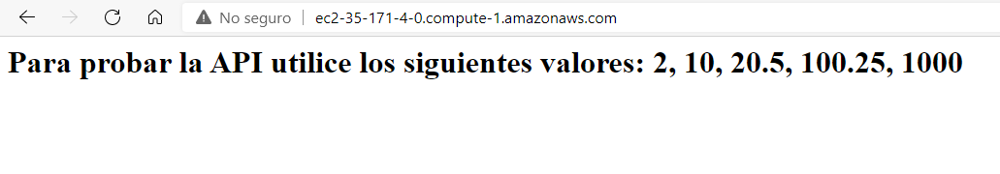
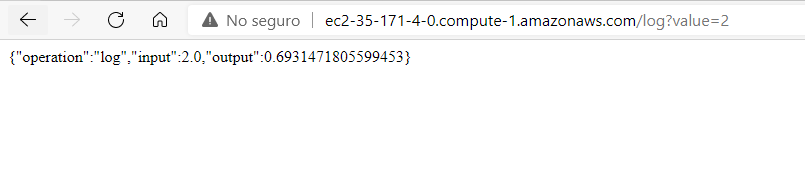
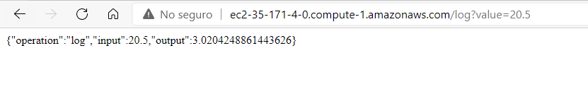
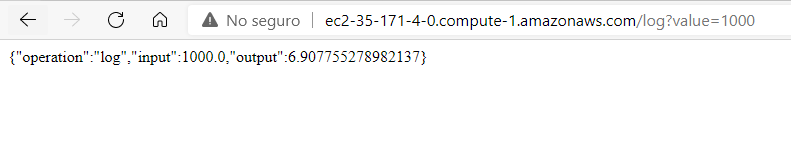

# Parcial Segundo Tercio
### Pre-requisitos
Para hacer uso del software es necesario tener instalado:
* Java: Como lenguaje de programación                                      
    Siga las instrucciones en https://docs.oracle.com/en/java/javase/15/install/
* Maven: Automatiza y estandariza el flujo de vida de la construcción de software.                 
    Siga las instrucciones en http://maven.apache.org/download.cgi#Installation
* Git: Administrador descentralizado de configuraciones.                     
    Siga las instrucciones en http://git-scm.com/book/en/v2/Getting-Started-Installing-Git
* Docker Desktop: Automatizar el despliegue de aplicaciones dentro de contenedores de software                                   
    Siga las instrucciones en https://www.docker.com/products/docker-desktop
### Índice
* [Introducción](#introducción) 
* [Imagenes del funcionamiento](#imagenes-del-funcionamiento)
* [Despliegue de la aplicación](#despliegue-de-la-aplicación)
* [Video del funcionamiento](#video-del-funcionamiento)
### Introducción 
Diseñar, construir y despliegar el servicio **log** en un microcontenedor docker desplegado en una instancei a EC2 de AWS. Las función reciben un solo parámetro de tipo "Double", con el nombre de value, y retorna
un JSON que contiene el resultado de la operación.                                 
[Link a la segunda parte del parcial](https://github.com/germanAOQ/AREP-Parcial2-Lambda)
### Imagenes del funcionamiento 




### Despliegue de la aplicación
1. Cree una máquinas virtuales con el servicio EC2 de AWS
2. Conectese a través de un cliente ssh a la máquina utilizando el archivo .pem
3. Clone el actual repositorio:
```
git clone https://github.com/germanAOQ/AREP-Parcial2-EC2
```

6. Compile el proyecto desde la raiz de este:
```
mvn clean install
```
7. Cree la images docker:
```
docker build --tag triserver .
```
8 Cree el contenedor y corralo:
```
docker run -d -p 80:6000 --name triservercontainer triserver
```
9. Ingrese usando el DNS de la máquina
### Video del funcionamiento 
[Funcionamiento de la aplicación](https://youtu.be/kqAEGH1BhZw)